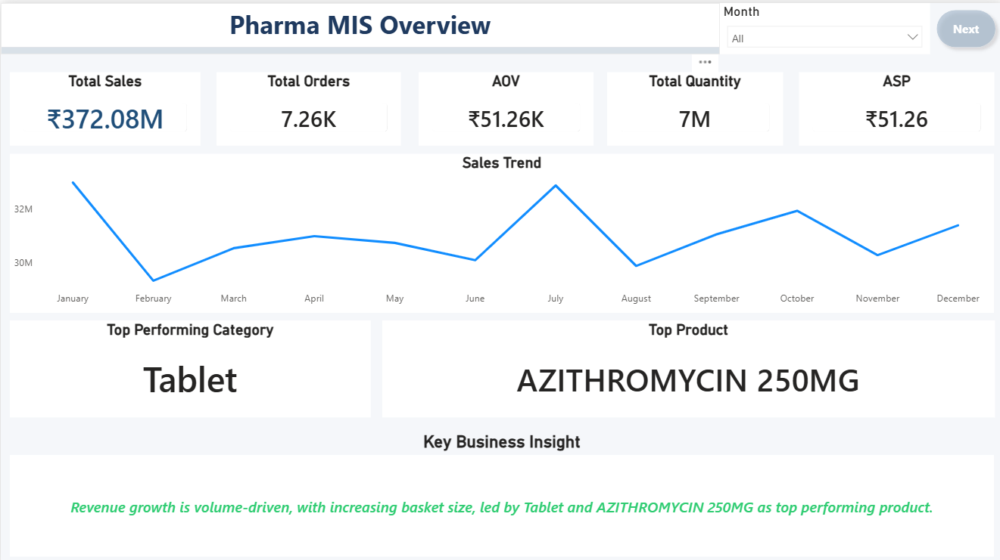

# 💊 Pharma MIS Dashboard | Power BI Project

---

# 📌 Project Overview

This project focuses on developing an interactive **Pharma MIS Dashboard** using **Power BI** to monitor pharmaceutical sales performance, business KPIs, product contribution, regional trends, and sales representative effectiveness.

The dashboard is designed to support **data-driven business decisions** through interactive reporting and business intelligence analysis.

---

# 🎥 Dashboard Walkthrough Video

▶️ [Watch Interactive Dashboard Demo](https://youtu.be/V_fluo999rY)

---

# 🎯 Business Objective

The objective of this project was to create a Management Information System (MIS) dashboard capable of helping business stakeholders monitor:

- 📈 Sales performance
- 💰 Revenue trends
- 💊 Product contribution
- 🌍 Regional performance
- 👨‍💼 Sales representative effectiveness
- 📊 Business growth drivers

---

# 🛠️ Tools & Technologies Used

| Category | Tools |
|---|---|
| BI & Visualization | Power BI |
| Data Transformation | Power Query |
| Calculations | DAX |
| Data Source | Excel |
| Modeling | Data Modeling |

---

# ✨ Key Features

✅ Executive KPI Monitoring  
✅ Interactive Navigation Buttons  
✅ Dynamic Month Filtering  
✅ Sales Trend Analysis  
✅ Product Performance Analysis  
✅ Regional Sales Analysis  
✅ Sales Representative Tracking  
✅ Business Insight Cards  
✅ Multi-Page Interactive Dashboard  

---

# 📄 Dashboard Pages

## 1️⃣ Pharma MIS Overview
Provides high-level KPI visibility including:
- Total Sales
- Total Orders
- AOV
- Quantity Sold
- ASP
- Monthly Sales Trend
- Top Product & Category Insights

---

## 2️⃣ Sales Drivers Analysis
Focuses on:
- Sales Index Trends
- ASP Performance
- Product Contribution
- Revenue Drivers
- Volume-Based Growth Patterns

---

## 3️⃣ Regional Sales Analysis
Includes:
- City-wise Revenue
- Geographic Sales Distribution
- Regional Order Analysis
- Top Performing Cities

---

## 4️⃣ Sales Team Performance Analysis
Evaluates:
- Sales Representative Revenue
- Sales Activity Performance
- Representative Ranking
- Team Productivity Insights

---

# 🧹 Data Preparation & Transformation

The project involved multiple data cleaning and transformation steps including:

- Missing value handling
- Exception record management
- Date cleaning & formatting
- Category mapping
- Power Query transformations
- Data modeling
- KPI measure creation using DAX

Special focus was given to maintaining reporting consistency and analytical accuracy.

---

# 📌 Key Business Insights

📈 Revenue growth is primarily volume-driven.  
💊 Tablet category contributes the highest sales revenue.  
🌍 Vadodara leads regional performance.  
👨‍💼 PRIYA is the top-performing sales representative.  
📊 Sales activity and order size significantly influence revenue growth.  

---

# 🧠 Skills Demonstrated

- Business Intelligence Reporting
- Dashboard Design
- Data Cleaning & Transformation
- DAX Calculations
- Data Modeling
- Business KPI Analysis
- Interactive Visualization
- Data Storytelling
- MIS Reporting
- Analytical Thinking

---

# 📂 Repository Contents

📁 Power BI Dashboard (.pbix)  
📁 Dashboard Screenshots  
📁 Project Documentation  
📁 Dashboard Walkthrough Video  

---

# 🚀 Future Enhancements

Planned future improvements include:

- SQL-based data extraction workflows
- Automated refresh integration
- Advanced analytics implementation
- Cloud-based dashboard deployment
- Interactive web publishing

---

# ✅ Conclusion

This project demonstrates the development of a business-oriented Pharma MIS Dashboard capable of transforming raw sales data into actionable business insights using Power BI.

The dashboard structure supports:
- operational monitoring,
- performance evaluation,
- and data-driven decision-making within pharmaceutical distribution environments.

---

# 👨‍💻 Author

**Jaymin Prajapati**  
Aspiring Data Analyst | Power BI Enthusiast | Business Analytics Learner
